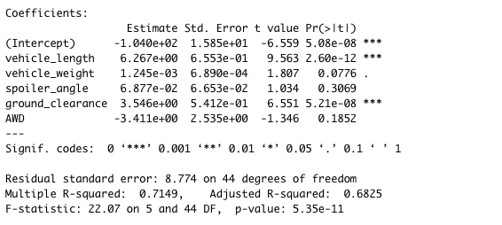
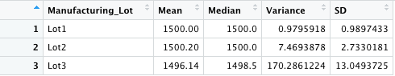
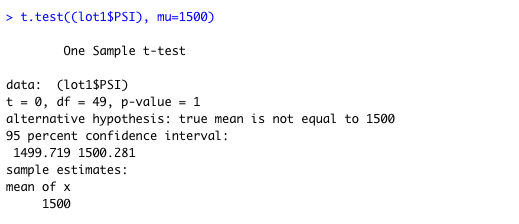
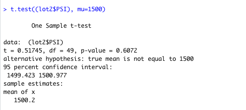
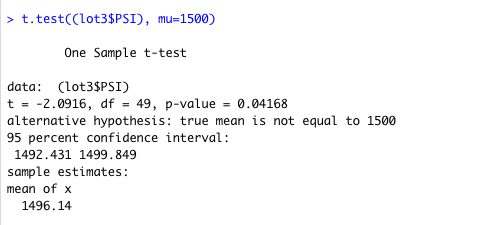

# MechaCar_Statistical_Analysis

# Purpose
AutosRUs’ newest prototype, the MechaCar, is suffering from production troubles that are blocking the manufacturing team’s progress. The purpose of this
analysis is to review the production data for insights that may help the manufacturing team. 

# Results

## Linear Regression to Predict MPG
AutoRUs provided a dataset that contains mpg test results for 50 prototype MechaCars. The dataset contained multiple metrics, such as vehicle length,
vehicle weight, spoiler angle, drivetrain, and ground clearance. Using this dataset, a multiple linear regression model was designed to determine the
correlation between variables. The lm() function was ran, with mpg set as the dependent variable and the remaining metrics as the independent variables.
The summary() function was ran to determine the p-value and the r-squared value for the linear regression model. Following is a summary of key results.

1. Based on the p-value results, the vehicle weight, spoiler angle and drive train provided significant non-random amount of variance to the mpg values. 

2. The slope of the linear model is not considered to be zero. The p-value is below a significant level of 0.05. As such, there is sufficient evidence
to reject the null hypothesis, which states that the slope of the linear model is zero. 

3. Based on the r-squared value of 0.7149, there is a strong positive correlation between the variables. Therefore, it is assumed that the model will
predict mpg of MechaCars prototypes effectively. 

## Summary Statistics on Suspension Coils
AutoRUs also provided a dataset that contains the results from multiple production lots. In this dataset, the weight capacities of multiple suspension
coils were tested to determine if the manufacturing process is consistent across production lots. As the design specifications for the MechaCar
suspension coils dictate that the variance of the suspension coils must not exceed 100 PSI, PSI metrics for each lot and total lots were calculated using
the group_By() and summarize() functions. 

Based on the results for total manufacturing lots, the variance of the suspension coils is 62.29356, which meets the design specifications. Similar
metrics were ran on each lot individually, and the results show that for lot 1 and lot 2, with variance of 0.97959 and 7.46939, respectively, the lots
meet design specifications, however, the variance for lot 3 of 170.28612 exceeds the design specifications. 

## T-Tests on Suspension Coils
Further, t-tests were performed to determine if all manufacturing lots and each lot individually are statistically different from the population mean of 
1,500 PSI. 

Based on the results of all manufacturing lots, the p-value is 0.06028. Assuming a significance level of 0.05, the p-value is above and therefore, there
is not sufficient evidence to reject the null hypothesis. The mean from all manufacturing lots and the mean from the population are statistically
similar. 

Similarly, the p-value of lot 1 and lot 2 individually are above the significance level of 0.05.  Therefore, there is not sufficient evidence to reject
the null hypothesis. The mean from the lot individually and the mean from the population are statistically similar. 

The p-value of lot 3 individually is below the significance level of 0.05.  Therefore, there is sufficient evidence to reject the null hypothesis. The
mean from the lot individually and the mean from the population are not statistically similar. 

## Study Design: MechaCar vs Competition

To compare the highway fuel efficiency of the MechaCar prototype against the performance of other vehicles the one-way ANOVA test can be performed. The 
one-way ANOVA test is used to compare the mean of a single dependent variable across a single independent variable with multiple groups. 

For this test, the null hypothesis states that the means of all groups are equal. The alternate hypothesis states that at least one of the means is
different from all other groups. 

In order to run the statistical test, metrics on highway fuel efficiency for MechaCars and other vehicles would need to be obtained.  
